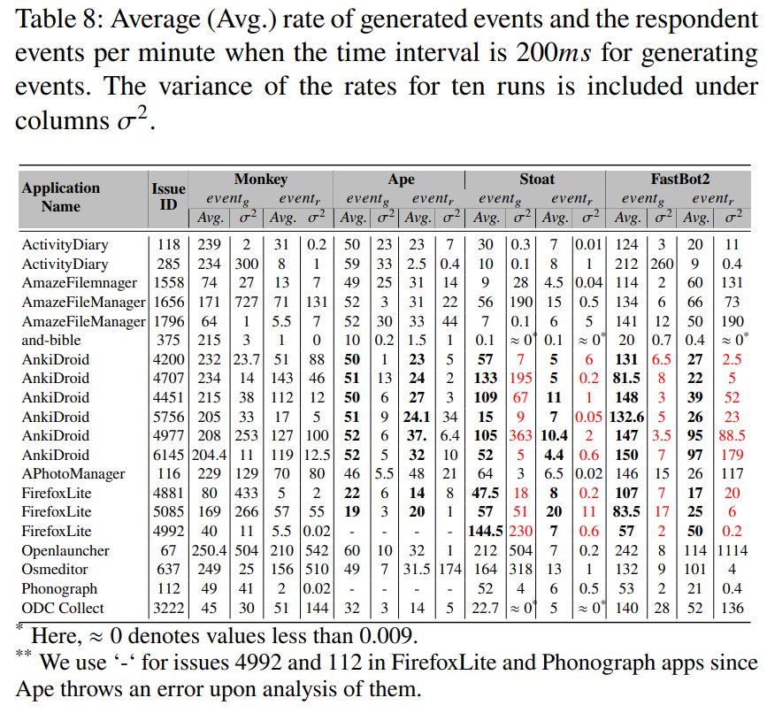

## Introduction
Mole is a static analysis tool that aims to find __precise__ sets of __reachable paths__ to trigger a crash concerning the __widget dependencies__ based on their visual attributes. Developers leverage widget attributes (e.g., visibility, focused, etc.) to impose relative _functional_ or _visual_ dependencies between widgets. These dependencies can help us to identify _relevant_ and _irrelevant_ widgets in reachable paths to a crash point when we have access to an app's bytecode. Mole performs an **Attribute-Sensitive Reachability Analysis (ASRA)** to find these paths by having access to the crash stack trace of a crash. A *crash stack trace* is a common resource consisting of the exception type, exception message, and the framework and app-level call stack. An example of a crash stack trace is given below:

````
 FATAL EXCEPTION: main
 Process: com.ichi2.anki, PID: 7186
 android.os.FileUriExposedException: file:///storage/emulated/0/Pictures/img_202006211308531497856152.jpg exposed beyond app through ClipData.Item.getUri()
 	at android.os.StrictMode.onFileUriExposed(StrictMode.java:1799)
 	at android.net.Uri.checkFileUriExposed(Uri.java:2346)
 	at android.content.ClipData.prepareToLeaveProcess(ClipData.java:845)
 	at android.content.Intent.prepareToLeaveProcess(Intent.java:8941)
 	at android.content.Intent.prepareToLeaveProcess(Intent.java:8926)
 	at android.app.Instrumentation.execStartActivity(Instrumentation.java:1517)
 	at android.app.Activity.startActivityForResult(Activity.java:4225)
 	at android.support.v4.app.BaseFragmentActivityJB.startActivityForResult(BaseFragmentActivityJB.java:50)
 	at android.support.v4.app.FragmentActivity.startActivityForResult(FragmentActivity.java:79)
 	at android.app.Activity.startActivityForResult(Activity.java:4183)
 	at android.support.v4.app.FragmentActivity.startActivityForResult(FragmentActivity.java:859)
 	at com.ichi2.anki.AnkiActivity.startActivityForResult(AnkiActivity.java:175)
 	at com.ichi2.anki.multimediacard.fields.BasicImageFieldController$2.onClick(BasicImageFieldController.java:125)
 	at android.view.View.performClick(View.java:5637)
 	at android.view.View$PerformClick.run(View.java:22429)
 	at android.os.Handler.handleCallback(Handler.java:751)
 	at android.os.Handler.dispatchMessage(Handler.java:95)
 	at android.os.Looper.loop(Looper.java:154)
 	at android.app.ActivityThread.main(ActivityThread.java:6119)
 	at java.lang.reflect.Method.invoke(Native Method)
 	at com.android.internal.os.ZygoteInit$MethodAndArgsCaller.run(ZygoteInit.java:886)
 	at com.android.internal.os.ZygoteInit.main(ZygoteInit.java:776)
````
Once the reachable paths and the widget attribute dependencies in them are found, one can categorize an app's widgets and events into two groups: 
- necessary and
- irrelevant

to trigger a crash.
With instrumentation, we intend to *disable* irrelevant widgets at run time. Thereafter, we can leverage fuzzing tools to explore the shrunk widget/event input space dynamically, exploring the crash. 

## Environment Setting
To set Mole, you need to  
- install Java version 1.8.
- download the [Android platforms](https://github.com/Sable/android-platforms). 

## Run Attribute-sensitive Reachability Analysis (ASRA)
To perform ASRA, you can use the file [mole.jar](https://hkustconnect-my.sharepoint.com/:f:/g/personal/mamt_connect_ust_hk/EtUpYqtvhrtJnlPH_zwuGxcBG2muF2BS7rN49dYdw6h50Q?e=Fbimep). To start the analysis, a configuration file in `JSON` format is needed for the setup. This file contains information about the path to the Android platform, callback list, and API specification files. It also has the path to the target app and details about the crash point in the app's bytecode. 

An example of a config file for the crash with issue ID 4707 in the AnkiDroid app is shown below:

````
{
	"android_setting": {
    "android_platform": "/home/maryam/Documents/Tool/Android-Testing-Tools/android-platforms/",
    "android_callback_list": "/home/maryam/IdeaProjects/SootTutorial/files/AndroidCallbacks.txt",
    "callback_typestates": "/home/maryam/IdeaProjects/SootTutorial/files/androidCallbackTypestate.xml"
 	 },
    "application_setting": { 
      "target_app": "AnkiDroid-2.9alpha4-4707.apk",
      "target_package": "com.ichi2",
      "target_class": "com.ichi2.anki.AnkiActivity",
      "target_method": "<com.ichi2.anki.AnkiActivity: void startActivityForResult(android.content.Intent,int)>",
      "target_line": "175"
    },
    "analysis_setting": {
      "output_path": "/home/maryam/IdeaProjects/SootTutorial/output/revision/"
    }
  }

````

In this file,
- `android_platform` is the path to Android platforms jar files. 
- `android_callback_list` is the path of the file, including the set of callback functions in the Android framework (e.g., the file AndroidCallbacks.txt in FlowDroid).
- `output_path` is the output folder.
- `target_app` is the name of the target application to analyze. This file should be added under a folder named ./demo/IntervalAnalysis.  
- `target_package` is the package of the application
- `target_class` is the name of the class where the last function in the application calls stack in the crash stack trace.
- `target_method` is the function signature where the last function in the application calls stack in the crash stack trace.
- `target_line` is the line number of the crash point available in the crash stack trace.

> [!NOTE]
> We have made the android callback list and GUI attribute API specification in `FlowDroid/AndroidCallbacks.txt` and `FlowDroid/GUI_STATE_API.csv` respectively. 

When the config file is prepared, you must save it under the same directory with `mole.jar` structured as follows:
 ````
 Mole
       |
       |--- mole.jar
       |--- config.json
       |--- output
           | 
	   
````
Then, you can use `java` to run the `mole.jar` to start the analysis, giving the path to the config file, setting the type of the analysis and callgraph construction algorithm as shown below:


````
java -jar mole.jar -f <config-file> -ca <callgraph algorithm> -type <baseline/reach/event> -t <callgraph construction timeout>
````

Here,
- `-f`: Add the path where the config file is located.
- `—ca`: Add the desired callgraph construction algorithm in FlowDroid (CHA/SPARK/etc.). The default algorithm is SPARK.
- `-type`: Add the type of scenarios for analysis that can be any of the three:
  - baseline: no analysis,
  - reach: performing reachability analysis,
  - event: performing attribute-sensitive reachability analysis.
- `-t`: add the timeout for callgraph construction performed by flowdroid.

> [!NOTE]
> When the analysis is finished, the instrumented `apk` file is saved under the folder `./output/instrument/.`

## Fuzzing Tool Setup
We used an Android emulator with Android 7.1 and installed the instrumented apk in it to launch the fuzzing process. We provide a docker file setting up [Themis](https://github.com/the-themis-benchmarks/home), including
- an Android emulator
- a set of fuzzing tools (Monkey, Ape, Stoat, and FastBot2)
  
available in this [link](https://hkustconnect-my.sharepoint.com/:u:/g/personal/mamt_connect_ust_hk/Eeb9jDXM4iFDoh5OJIo2h94BDTz7Gg80ukKM4HNWMFQ19Q?e=gJWZu0).

To start the fuzzing process with this docker, you first need to transfer the instrumented apk files into the docker:

````
docker run -it <docker-image-name>
root@docker-id: cd home
root@docker-id: mkdir apps
root@docker-id: cd apps
root@docker-id: scp host@domain:path-to-apk .
root@docker-id: exit
docker commit <docker-id> <docker-image-name>
````

Next, you can use `scripts/run-themis.sh` to create `n` instances of the docker.
````
./run-themis.sh <fuzzing-tool-name> <path-to-target-apps> <n>
````
in which,
- `fuzzing-tool-name` refers to the name of a fuzzing tool, which can be any of `monkey,` `ape,` `stoat,` or `fastbot2`.
- `path-to-target-apps` is the path to the list of target apps' apk files to perform `n` fuzzing process for each simultaneously. Please note that you have already added these files to the docker.
- `n` is the number of fuzzing processes for each app in the target app directory.

>[!NOTE]
> Please note that you can change the fuzzing duration in `run-themis.sh` at the line by modifying the value in front of `--time` and adding duration in the format `number[m/h].` m and h refer to minutes and hours measures. 


If you want to use other GUI fuzzing tools, you can check [Themis repository](https://github.com/the-themis-benchmarks/home) and modify the docker by adding other tools.


## Crash Reproduction Result
When the fuzzing process is finished, you can find the output in the docker under `/home/output/` folder. For each app, there is a directory named similar to the app file name. We log all the exceptions and trace the generated events by the fuzzing tools in a file called `logcat.log` under this folder. In this file, each line starts with the *time* and declares the *start* or *end* of a callback execution. It is also clarified in each line if an event is necessary or irrelevant. A necessary event is accepted and executed. An irrelevant event is pruned at runtime and is not executed by the app under test. Also, we log the name of the class and callback function corresponding to each event in each line. Below is a sample part of a log file we collect: 

````
01-05 23:53:24.123  4858  4858 I <FUZZING>: start necessary: access$100 com.ichi2.anki.NavigationDrawerActivity
01-05 23:53:24.123  4858  4858 I <FUZZING>: end necessary: access$100 com.ichi2.anki.NavigationDrawerActivity
01-05 23:53:25.032  4858  4858 I <FUZZING>: start necessary: onNavigationItemSelected com.ichi2.anki.NavigationDrawerActivity
01-05 23:53:25.032  4858  4858 I <FUZZING>: end necessary: onNavigationItemSelected com.ichi2.anki.NavigationDrawerActivity
01-05 23:53:25.649  4858  4858 I <FUZZING>: start necessary: initNavigationDrawer com.ichi2.anki.NavigationDrawerActivity
01-05 23:53:25.649  4858  4858 I <FUZZING>: end necessary: initNavigationDrawer com.ichi2.anki.NavigationDrawerActivity
01-05 23:53:25.748  4858  4858 E ACRA    : ACRA caught a VerifyError for com.ichi2.anki
01-05 23:53:25.748  4858  4858 E ACRA    : java.lang.VerifyError: Verifier rejected class com.ichi2.anki.Statistics$SectionsPagerAdapter: void com.ichi2.anki.Statistics$SectionsPagerAdapter.<init>(com.ichi2.anki.Statistics, android.support.v4.app.FragmentManager) failed to verify: void com.ichi2.anki.Statistics$SectionsPagerAdapter.<init>(com.ichi2.anki.Statistics, android.support.v4.app.FragmentManager): [0x3B] Constructor returning without calling superclass constructor (declaration of 'com.ichi2.anki.Statistics$SectionsPagerAdapter' appears in /data/app/com.ichi2.anki-1/base.apk)
01-05 23:53:25.748  4858  4858 E ACRA    : 	at com.ichi2.anki.Statistics.onCollectionLoaded(Statistics.java)
01-05 23:53:25.748  4858  4858 E ACRA    : 	at com.ichi2.anki.AnkiActivity.onLoadFinished(AnkiActivity.java)
01-05 23:53:25.748  4858  4858 E ACRA    : 	at com.ichi2.anki.AnkiActivity.onLoadFinished(AnkiActivity.java)
01-05 23:53:25.748  4858  4858 E ACRA    : 	at android.support.v4.app.LoaderManagerImpl$LoaderInfo.callOnLoadFinished(LoaderManager.java)
01-05 23:53:25.748  4858  4858 E ACRA    : 	at android.support.v4.app.LoaderManagerImpl$LoaderInfo.onLoadComplete(LoaderManager.java)
01-05 23:53:25.748  4858  4858 E ACRA    : 	at android.support.v4.content.Loader.deliverResult(Loader.java)
01-05 23:53:25.748  4858  4858 E ACRA    : 	at com.ichi2.async.CollectionLoader.deliverResult(CollectionLoader.java)
01-05 23:53:25.748  4858  4858 E ACRA    : 	at com.ichi2.async.CollectionLoader.deliverResult(CollectionLoader.java)
01-05 23:53:25.748  4858  4858 E ACRA    : 	at android.support.v4.content.AsyncTaskLoader.dispatchOnLoadComplete(AsyncTaskLoader.java)
01-05 23:53:25.748  4858  4858 E ACRA    : 	at android.support.v4.content.AsyncTaskLoader$LoadTask.onPostExecute(AsyncTaskLoader.java)
01-05 23:53:25.748  4858  4858 E ACRA    : 	at android.support.v4.content.ModernAsyncTask.finish(ModernAsyncTask.java)
01-05 23:53:25.748  4858  4858 E ACRA    : 	at android.support.v4.content.ModernAsyncTask$InternalHandler.handleMessage(ModernAsyncTask.java)
01-05 23:53:25.748  4858  4858 E ACRA    : 	at android.os.Handler.dispatchMessage(Handler.java:102)
01-05 23:53:25.748  4858  4858 E ACRA    : 	at android.os.Looper.loop(Looper.java:154)
01-05 23:53:25.748  4858  4858 E ACRA    : 	at android.app.ActivityThread.main(ActivityThread.java:6119)
01-05 23:53:25.748  4858  4858 E ACRA    : 	at java.lang.reflect.Method.invoke(Native Method)
````
### Is the Crash Reproduced?
Once the fuzzing is finished, you can use the script `scripts/check.sh` to search for a crash in the collected files. This script accepts the directory path where the folders of fuzzing outputs are stored. 
````
check.sh `/home/output/`
````
where `/home/output/` consists of the directories of the results of the fuzzing tool. By running this script, you get the crash reproduction time and the following output files if the crash is reproduced:
- `found.log` has a trace of all the callbacks before the crash.
- `irrelevant.txt` contains a trace of irrelevant callbacks before the crash occurred.
- `necessary.txt` consists of the necessary callbacks trace before the occurrence of the crash.

We have made all the log files of our evaluation available in this [link](https://hkustconnect-my.sharepoint.com/:u:/g/personal/mamt_connect_ust_hk/EcaM0uwNAjRNtKaLtpFjnfYBiUym7EUaL_0aC20mj9dcyA?e=OSgDQT), which is around 280 GB after decompressing the zip file. **You can download and unzip this folder and use `check.sh` to replicate the results we collected in the evaluation process**. 

### Event Generated and GUI Models Constructed by Fuzzing Tools
In addition to `logcat.log,` each fuzzing tool collects information about the generated input events and models it constructs (statically or dynamically). For instance, Monkey logs the coordination, generating an event with the event type in `monkey.log` for each app. For other fuzzing tools, please get more information from their repositories or websites available at [Ape](https://github.com/tianxiaogu/ape), [Stoat](https://tingsu.github.io/files/stoat.html), and [FastBot2](https://github.com/bytedance/Fastbot_Android).

## Replication Package of Our Manuscript
We have used the 20 apps under the `apps` directory to evaluate our work. We tried to answer the following research questions:
- **RQ1**: How effective is Mole in speeding up crash reproduction compared to the baseline fuzzing tools?
- **RQ2**: How common are the widget dependencies imposed by collected widget attributes in Android applications?
- **RQ3**: What is the accuracy of Mole in statically and dynamically detecting the reachable paths to the crash point?
- **RQ4**: How scalable is our proposed attribute-sensitive reachability analysis?
- **RQ5**: What is the overhead imposed by Mole’s instrumentation at run time?

### RQ1: Mole's Effectiveness in Crash Reproduction
We used the success/failure in getting a crash reproduced and the crash reproduction time to show the effectiveness of ASRA. Below is Table 6, which provides this information in our manuscript:
<p align="center">

</p>

For more detailed information about the execution time of every single run of the total ten runs, we provided the Excel file named `replication-data.xlsx.` In this file,  we have used the four sheets named `Monkey (RA/ASRA/Mole),` `Ape (RA/ASRA/Mole),` `Stoat (RA/ASRA/Mole),` and `FastBot2 (RA/ASRA/Mole)` to store all the data of 
- execution time for each single run (e,g, under columns with format *#number*)
- average, median, maximum, and minimum execution time of all the ten runs in hours.
- success ratio.
- Fisher exact statistical test results p-value.
- Wilcoxon Mann-Whittney statistical test results with p-value and Valgra Delany (A12).
  
in our three designated baseline, RA, and ASRA scenarios. 

You can reuse the formulas used in the Excel file to calculate the
- success ratio
- p-value in both Fisher exact and Wilcoxon Mann-Whittney tests.
- Vargha Delaney in Wilcoxon Mann-Whittney test.

### RQ2 and RQ4: Attribute-Sensitive Reachability Analysis Results:
We provided detailed data about found attributes for each crash by our proposed Attribute-Sensitive Reachability analysis under the sheet `ASRA` in the Excel file `replication-data.xlsx.` This data is presented in Figure 7 in our manuscript and shown below:
<div align="center">

</div>

### RQ3: Static Analysis False Positives and Dynamic Analysis False Negatives:
We provided raw data in Table 7 in our manuscript and discussed the results under section 5.6. 
<div align="center">

</div>

### RQ5: Overhead of the Instrumentation and Fuzzing Tools' Event Generation:
We used two measurements of generated event rates by a fuzzing tool (event<sub>g</sub>) and the respondent event rates by an app (event<sub>r</sub>) to assess the effect of our instrumentation overhead in the event generation process. We provided the average result of event<sub>g</sub> and event<sub>r</sub> in Tables 8 and 9 in our manuscript. Please note that the values entered in the below table are rounded. We provided the event generation and respondent time for each run in milliseconds under the sheet `Event-rate` sheet in the Excel file `replication-data.xlsx.`. We also measured the average overhead imposed for each crash separately by dividing event<sub>g</sub> by event<sub>r</sub> in this sheet.   

<div align="center">


</div>
